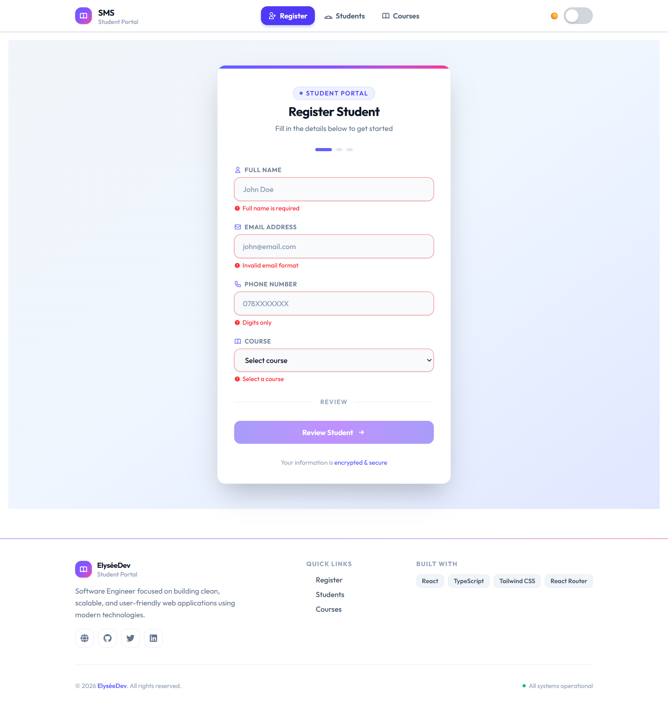
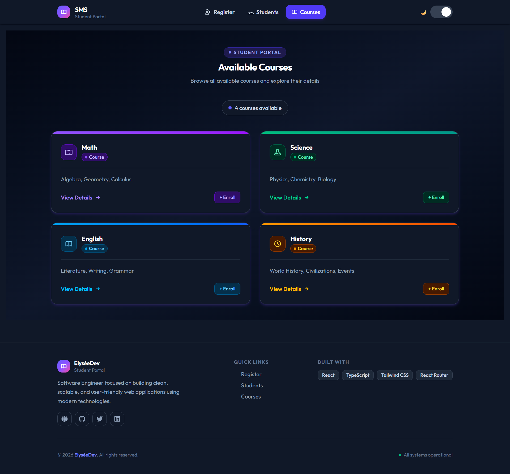

<div align="center">

# 🎓 Student Management System 👨‍🎓

A modern, production-ready student management system built with React, TypeScript, and Tailwind CSS featuring registration flows, student tracking, course management, and dynamic theme switching.


### **Built with:**


## 🚀 Live Demo

Visit the 👉 [_LINK 🔗_](https://sms-ecru-chi.vercel.app)

| Register Page                                | Courses Page                               |
| -------------------------------------------- | ------------------------------------------ |
|  |  |

</div>

---

## 📋 Table of Contents

- [🎓 Student Management System 👨‍🎓](#-student-management-system-)
  - [**Built with:**](#built-with)
  - [🚀 Live Demo](#-live-demo)
  - [📋 Table of Contents](#-table-of-contents)
  - [✨ Features Overview](#-features-overview)
  - [🛠️ Tech Stack](#️-tech-stack)
  - [📸 Core Modules](#-core-modules)
    - [👤 Student Registration](#-student-registration)
    - [📚 Student Management](#-student-management)
    - [🎓 Courses Module](#-courses-module)
    - [🌗 Theme System](#-theme-system)
    - [📱 Responsive Design](#-responsive-design)
    - [🔔 Notifications](#-notifications)
  - [🧭 Routing Architecture](#-routing-architecture)
  - [🏗️ Project Structure](#️-project-structure)
  - [💾 Data Persistence](#-data-persistence)
    - [LocalStorage Keys](#localstorage-keys)
    - [Example Student Object Structure](#example-student-object-structure)
  - [🎨 UI/UX Highlights](#-uiux-highlights)
  - [⚙️ Installation \& Setup](#️-installation--setup)
    - [Prerequisites](#prerequisites)
    - [Quick Start](#quick-start)
    - [Environment Setup](#environment-setup)
  - [📦 Build \& Deployment](#-build--deployment)
    - [Development Build](#development-build)
    - [Production Build](#production-build)
    - [Preview Production Build](#preview-production-build)
    - [Linting](#linting)
  - [📌 Future Roadmap](#-future-roadmap)
  - [👨‍💻 Author](#-author)
  - [🏁 Summary](#-summary)
  - [📄 License](#-license)
  - [📞 Contact](#-contact)
    - [⭐ Star this repository if you find it useful for your learning journey!](#-star-this-repository-if-you-find-it-useful-for-your-learning-journey)

---

## ✨ Features Overview

| Category               | Features                                                      |
| ---------------------- | ------------------------------------------------------------- |
| **Registration**       | Multi-step process, real-time validation, auto-save draft     |
| **Student Management** | View all students, search by name, delete with confirmation   |
| **Course Management**  | Course listing, detailed views, enrolled students per course  |
| **Theme System**       | Light/Dark mode, persistent preference, instant UI updates    |
| **Responsive Design**  | Mobile-first layout, hamburger menu, adaptive grid system     |
| **Notifications**      | Toast messages for success/error, user-friendly confirmations |

---

## 🛠️ Tech Stack

<div align="center">

| Technology                                                                                              | Version | Purpose       |
| ------------------------------------------------------------------------------------------------------- | ------- | ------------- |
|                        | 18      | UI Library    |
|        | 5.0     | Type Safety   |
|                          | 5.0     | Build Tool    |
|       | 3.4     | Styling       |
|  | 6.x     | Navigation    |
|       | 2.4.0   | Notifications |

</div>

---

## 📸 Core Modules

### 👤 Student Registration

- ✅ Multi-step registration process
- ✅ Real-time form validation
- ✅ Auto-save draft in localStorage
- ✅ Confirmation step before saving
- ✅ Input validation (email, phone, required fields)
- ✅ Disabled submit until form is valid
- ✅ Draft persistence across sessions

### 📚 Student Management

- ✅ View all registered students
- ✅ Search by name functionality
- ✅ Delete students with confirmation dialog
- ✅ Summary dashboard with metrics:
  - Total students count
  - Students per course breakdown

### 🎓 Courses Module

- ✅ List all available courses
- ✅ View detailed course information
- ✅ See enrolled students per course
- ✅ Dynamic route parameter support
- ✅ Static course data with filtering

### 🌗 Theme System

- ✅ Light and dark mode toggle
- ✅ Persistent theme preference using localStorage
- ✅ Instant UI update on theme switch
- ✅ Smooth transition effects

### 📱 Responsive Design

- ✅ Mobile-first layout approach
- ✅ Hamburger navigation menu for mobile
- ✅ Adaptive grid system for all screen sizes
- ✅ Touch-friendly interface

### 🔔 Notifications

- ✅ Success and error feedback via toast messages
- ✅ User-friendly action confirmations
- ✅ Non-intrusive notifications

---

## 🧭 Routing Architecture

| Route                 | Component     | Description                       | Protected |
| --------------------- | ------------- | --------------------------------- | --------- |
| `/register`           | Register      | Student registration form         | ❌        |
| `/confirmation`       | Confirmation  | Review student data before saving | ⚠️\*      |
| `/students`           | Students      | Student list dashboard            | ❌        |
| `/course`             | Course        | Course listing page               | ❌        |
| `/course/:courseName` | CourseDetails | Dynamic course details page       | ❌        |
| `*`                   | NotFound      | 404 page for invalid routes       | ❌        |

> ⚠️ \*Confirmation route validates that draft data exists before allowing access

---

## 🏗️ Project Structure

```console
src/
├── 📁 components/
│   ├── 📁 layout/           # Layout wrappers (Header, Footer, Sidebar)
│   └── 📁 ui/               # Reusable UI components (Button, Card, Modal)
├── 📁 features/
│   ├── 📁 students/         # Student-related logic & components
│   └── 📁 theme/            # Theme context & toggle components
├── 📁 pages/
│   ├── 📁 Register/         # Multi-step registration form
│   ├── 📁 Students/         # Student dashboard & management
│   ├── 📁 Course/           # Course listing & details
│   ├── 📁 Confirmation/     # Registration review page
│   └── 📁 NotFound/         # 404 error page
├── 📁 utils/
│   ├── storage.ts           # localStorage helpers
│   ├── validation.ts        # Form validation utilities
│   └── constants.ts         # Course data & app constants
├── 📁 types/
│   ├── student.types.ts     # Student interface definitions
│   └── course.types.ts      # Course interface definitions
├── 📁 hooks/
│   ├── useLocalStorage.ts   # Custom localStorage hook
│   └── useTheme.ts          # Theme management hook
├── App.tsx                  # Root component & routes
├── main.tsx                 # Application entry point
└── index.css                # Global styles & Tailwind imports
```

---

## 💾 Data Persistence

### LocalStorage Keys

| Key                  | Purpose                                 | Data Structure        |
| -------------------- | --------------------------------------- | --------------------- |
| `studentDraft`       | Stores unfinished registration progress | `StudentDraft` object |
| `registeredStudents` | Stores all confirmed/saved students     | `Student[]` array     |
| `theme`              | Stores UI theme preference              | `'light' \| 'dark'`   |

### Example Student Object Structure

```typescript
interface Student {
  id: string;
  fullName: string;
  email: string;
  phone: string;
  course: string;
  registeredAt: Date;
  status: "active" | "inactive";
}
```

---

## 🎨 UI/UX Highlights

- 🎴 **Clean card-based layout** - Modern and scannable design
- 🌙 **Dark mode support** - Eye-friendly night theme
- ✨ **Smooth hover transitions** - Polished interaction feedback
- 📐 **Responsive grid system** - Adapts to any screen size
- 🧭 **Active route navigation styling** - Clear current location indicator
- 🍞 **Toast notifications** - Subtle yet effective feedback
- 🔍 **Search functionality** - Quick student lookup
- 🗑️ **Delete confirmation** - Prevents accidental data loss

---

## ⚙️ Installation & Setup

### Prerequisites

- Node.js (v18 or higher)
- npm or yarn package manager

### Quick Start

```console
# Clone the repository
git clone https://github.com/elyse502/student-management.git

# Navigate to project directory
cd student-management

# Install dependencies
npm install

# Start development server
npm run dev
```

### Environment Setup

Create a `.env` file (optional for backend integration):

```env
VITE_API_URL=http://localhost:3000/api
VITE_APP_NAME=Student Management
```

---

## 📦 Build & Deployment

### Development Build

```console
npm run dev
# Runs on http://localhost:5173
```

### Production Build

```console
npm run build
# Outputs to /dist directory
```

### Preview Production Build

```console
npm run preview
# Serves the built application locally
```

### Linting

```console
npm run lint
# Runs ESLint for code quality checks
```

---

## 📌 Future Roadmap

- [ ] ✏️ **Edit Student Feature** - Modify existing student records
- [ ] 📄 **Pagination** - Handle large datasets efficiently
- [ ] 🎭 **Custom Modals** - Replace browser confirm dialogs
- [ ] ✨ **Animations** - Integrate Framer Motion for smooth transitions
- [ ] 🗄️ **Backend Integration** - Connect to Node.js / Firebase
- [ ] 🔐 **Authentication** - User login and role-based access
- [ ] 📊 **Advanced Analytics** - Charts and enrollment trends
- [ ] 📧 **Email Notifications** - Send confirmation emails
- [ ] 📎 **File Upload** - Student documents and photos

---

## 👨‍💻 Author

Built as a comprehensive learning project to demonstrate:

- ✅ **React Architecture** - Component composition and reusability
- ✅ **State Management Patterns** - Local state, context, and localStorage
- ✅ **Routing Design** - Dynamic routes and navigation guards
- ✅ **UI/UX Structuring** - User-centered design principles
- ✅ **Type-Safe Development** - Full TypeScript implementation
- ✅ **Form Validation** - Real-time validation patterns
- ✅ **Persistent Storage** - Client-side data persistence

---

## 🏁 Summary

This Student Management System delivers a complete frontend solution with:

| Aspect             | Implementation                                   |
| ------------------ | ------------------------------------------------ |
| **Architecture**   | Modular, feature-based organization              |
| **State Design**   | Scalable with localStorage persistence           |
| **Components**     | Reusable, composable UI elements                 |
| **User Flows**     | Real-world registration and management workflows |
| **Type Safety**    | Full TypeScript coverage                         |
| **Responsiveness** | Works seamlessly across all devices              |

---

## 📄 License

This project is licensed under the MIT License - see the [LICENSE](LICENSE) file for details.

---

## 📞 Contact

For any questions or support, please contact:

- [**NIYIBIZI Elysée**](https://linktr.ee/niyibizi_elysee)👨🏿‍💻 | [Github](https://github.com/elyse502) | [Linkedin](https://www.linkedin.com/in/niyibizi-elys%C3%A9e/) | [Twitter](https://twitter.com/Niyibizi_Elyse).
- **Email**: <elyseniyibizi502@gmail.com>

[](https://www.linkedin.com/in/niyibizi-elys%C3%A9e/) [](https://twitter.com/Niyibizi_Elyse) [](https://github.com/elyse502)

<br/><hr/><br/>

<div align="center">

### ⭐ Star this repository if you find it useful for your learning journey!

**Built with 💻, 🎨, and ☕**

---

_Questions or feedback? Open an issue or reach out!_

---

[⬆ Back to Top](#-table-of-contents)

</div>
